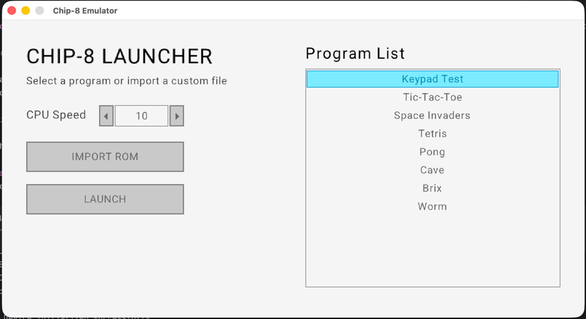
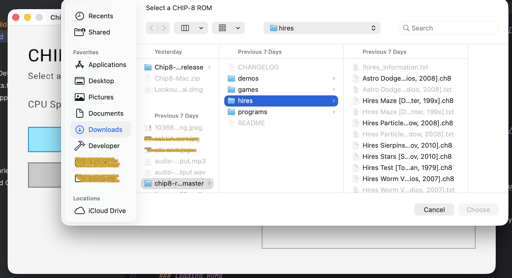
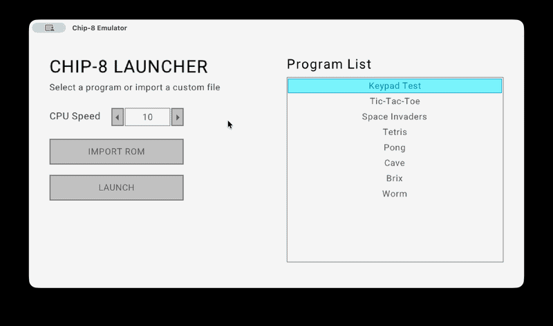

# CHIP-8 Emulator
A fully functional CHIP-8 emulator written in C++.




### Want to dive into the architecture, memory management, and opcode implementation? **[Check out the Technical Details](TechnicalDetails.md)**.

## ✨ Features
* Accurate opcode implementation based on cowgod's reference.
* Cross-platform support (Windows, macOS, (haven't tested the build on linux)).
* Automated CI pipeline for release builds.

## 🚀 Running the Emulator

Download the latest release for your OS from the [Releases](https://github.com/ashish757/Chip8-Emulator/releases) tab.

### Windows
1. Download and extract the `.zip` file.
2. Run the executable.
   *(Note: If you are missing any required libraries, ensure you have the MSVC redistributables installed).*

### macOS
macOS actively blocks applications from unverified developers. To bypass this without paying the Apple Developer fee, follow these steps:
1. Extract the downloaded zip and open the executable file.
2. It will likely be blocked. Open `System Settings` -> `Privacy & Security`
3. Scroll down and click `Open Anyway` next to the application block notification.

### Loading ROMs
You can load any ROM, simply click on the IMPORT ROM button and select a valid .ch8 file, then click on the launch button to play.

## 🎮 Controls
The original CHIP-8 used a 16-key hex keypad. This is mapped to your modern keyboard as follows:
<table>
  <thead>
    <tr>
      <th colspan="4" align="center">CHIP-8 Hex Keypad ➔ <kbd>Modern Keyboard</kbd></th>
    </tr>
  </thead>
  <tbody align="center">
    <tr>
      <td><b>1</b> ➔ <kbd>1</kbd></td>
      <td><b>2</b> ➔ <kbd>2</kbd></td>
      <td><b>3</b> ➔ <kbd>3</kbd></td>
      <td><b>C</b> ➔ <kbd>4</kbd></td>
    </tr>
    <tr>
      <td><b>4</b> ➔ <kbd>Q</kbd></td>
      <td><b>5</b> ➔ <kbd>W</kbd></td>
      <td><b>6</b> ➔ <kbd>E</kbd></td>
      <td><b>D</b> ➔ <kbd>R</kbd></td>
    </tr>
    <tr>
      <td><b>7</b> ➔ <kbd>A</kbd></td>
      <td><b>8</b> ➔ <kbd>S</kbd></td>
      <td><b>9</b> ➔ <kbd>D</kbd></td>
      <td><b>E</b> ➔ <kbd>F</kbd></td>
    </tr>
    <tr>
      <td><b>A</b> ➔ <kbd>Z</kbd></td>
      <td><b>0</b> ➔ <kbd>X</kbd></td>
      <td><b>B</b> ➔ <kbd>C</kbd></td>
      <td><b>F</b> ➔ <kbd>V</kbd></td>
    </tr>
  </tbody>
</table>

### CPU cycle speed
- you can contorl the number of instruction to be executed per second, by default its set to 10
- the screen runs at 60Hz, then the clock speed will be 60 * 10 = 600.


## 🛠️ Building from Source

To build this project locally, ensure you have a C++ compiler and cmake on your system.

```bash
git clone [https://github.com/ashish757/Chip8-Emulator.git](https://github.com/ashish757/Chip8-Emulator.git)
cd chip8-emulator
mkdir "build"
cd build
cmake ..
cmake --build
```

## The Final Boss: CI & Distribution
Getting the code to compile was only half the battle. Automating the distribution pipeline via Continuous Integration took countless iterations to resolve linker and config errors.
* **Windows "DLL Hell":** Windows constantly threw missing DLL and pathing errors. Because the development environment was macOS, debugging required pinging a non-tech friend with new `.exe` files after every build.
* **Apple Gatekeeper:** macOS actively blocks applications from unverified developers unless the $99/yr Apple Developer fee is paid. To bypass this without paying Tim Cook, users must manually override security settings, though building a standard `.app` bundle structure helps tame Gatekeeper slightly.


# Credits
1. cowgod's  Chip 8 technical reference http://devernay.free.fr/hacks/chip8/C8TECH10.HTM
2. The preloaded Chip8 ROMs are from kripod : https://github.com/kripod/chip8-roms
3. used Gemini to simplify some of the op codes and memory management, which were not clear in cowgod's blog

## AI
- Used JetBrain Clion's Auto completion.
- The UI(not the graphics engine) was created with the help of copilot and gemini, I learnt about Immediate Mode GUI, but took AI help, as my main goal was chip8, not UX.


